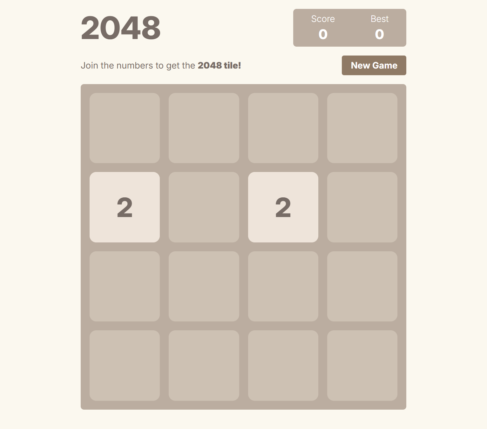

# 2048 Mock Game

## Overview

This repository contains my final exam project for a class on jQuery at Purdue University. It is a mock implementation of the popular 2048 game, created using JavaScript classes to handle the game logic and interactions along with jQuery for browser manipulation.

## Updates
- Added TypeScript to Game class for type saftey!

## Features

- Full implementation of 2048 gameplay mechanics.
- JavaScript classes used to encapsulate game state and behavior.
- Class methods designed to control and interact with game instances for clear and modular code structure.
- Used jQuery for dynamic updates and interactions.

## Screenshot



## How to Run

1. Clone this repository:
   ```bash
   git clone https://github.com/Griffinov22/2048-mock.git
   ```
2. Navigate to the project directory:
   ```bash
   cd 2048-mock
   ```
3. Open `index.html` in your web browser to start playing.

## Technologies Used

- **HTML/CSS**: For building the layout and styling of the game.
- **JavaScript (ES6)**: For game logic implemented using classes and methods.
- **jQuery**: For DOM manipulation and user interactions.

## How to Play

- Use the arrow keys to move the tiles in the desired direction.
- When two tiles with the same number collide, they merge into one with the sum of their values.
- The goal is to reach the tile with the value 2048.

---

Feel free to contribute or suggest improvements!
